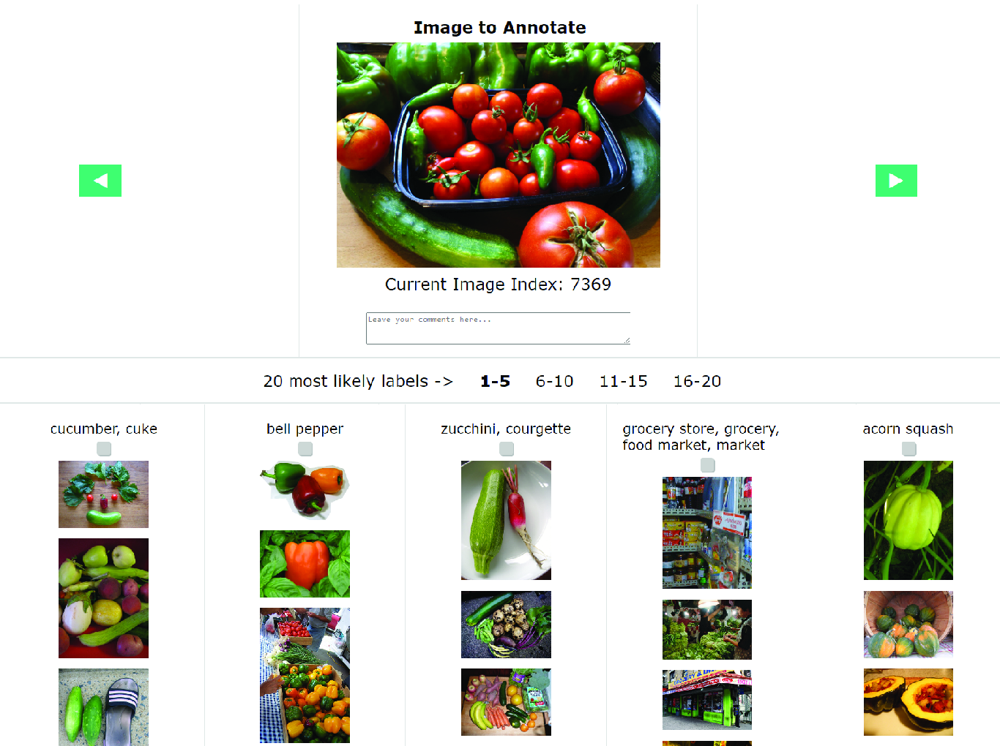

# Multilabelfy - Flask App

This repository hosts the **Multilabelfy** Flask application, a simple tool for enhancing the label quality of single-label datasets that are arguably multi-label. The app is specifically designed to streamline the annotation process for computer vision datasets, providing an intuitive web interface for annotators/researchers to efficiently review and refine image labels.



## USE CASE: ImageNetV2 Label Enhancement

Multilabelfy was used in the re-annotation process of **ImageNetV2**. The figure below illustrates the framework used for enhancing the label quality of ImageNetV2, leveraging human-machine interactions for dataset quality enhancement.


## Links to Resources

<div style="text-align: center; margin-top: 20px;">
  <h3 style="font-family: Arial, sans-serif; color: #333;">Links to Resources</h3>
  <div style="display: flex; justify-content: center; gap: 20px; margin-top: 10px; margin-bottom: 30px;">
    <a href="https://github.com/modestyachts/ImageNetV2" style="text-decoration: none;">
      <button style="
        background-color: #007BFF; 
        color: white; 
        border: none; 
        border-radius: 8px; 
        padding: 15px; 
        font-size: 16px; 
        font-family: Arial, sans-serif; 
        cursor: pointer; 
        box-shadow: 0px 4px 6px rgba(0, 0, 0, 0.1); 
        transition: transform 0.2s, box-shadow 0.2s; 
        width: 250px; 
        height: 80px; 
        display: flex; 
        justify-content: center; 
        align-items: center; 
        text-align: center;
      "
      onmouseover="this.style.backgroundColor='#0056b3'; this.style.transform='scale(1.05)'; this.style.boxShadow='0px 6px 10px rgba(0, 0, 0, 0.2)';"
      onmouseout="this.style.backgroundColor='#007BFF'; this.style.transform='scale(1)'; this.style.boxShadow='0px 4px 6px rgba(0, 0, 0, 0.1)';">
        ImageNetV2 Dataset <br>(imagenetv2-matched-frequency)
      </button>
    </a>
    <a href="https://www.example.com/refined-imagenetv2-labels" style="text-decoration: none;">
      <button style="
        background-color: #007BFF; 
        color: white; 
        border: none; 
        border-radius: 8px; 
        padding: 15px; 
        font-size: 16px; 
        font-family: Arial, sans-serif; 
        cursor: pointer; 
        box-shadow: 0px 4px 6px rgba(0, 0, 0, 0.1); 
        transition: transform 0.2s, box-shadow 0.2s; 
        width: 250px; 
        height: 80px; 
        display: flex; 
        justify-content: center; 
        align-items: center; 
        text-align: center;
      "
      onmouseover="this.style.backgroundColor='#0056b3'; this.style.transform='scale(1.05)'; this.style.boxShadow='0px 6px 10px rgba(0, 0, 0, 0.2)';"
      onmouseout="this.style.backgroundColor='#007BFF'; this.style.transform='scale(1)'; this.style.boxShadow='0px 4px 6px rgba(0, 0, 0, 0.1)';">
        Refined ImageNetV2 Labels
      </button>
    </a>
    <a href="https://multilabelfy.ngrok.app/demo" style="text-decoration: none;">
      <button style="
        background-color: #007BFF; 
        color: white; 
        border: none; 
        border-radius: 8px; 
        padding: 15px; 
        font-size: 16px; 
        font-family: Arial, sans-serif; 
        cursor: pointer; 
        box-shadow: 0px 4px 6px rgba(0, 0, 0, 0.1); 
        transition: transform 0.2s, box-shadow 0.2s; 
        width: 250px; 
        height: 80px; 
        display: flex; 
        justify-content: center; 
        align-items: center; 
        text-align: center;
      "
      onmouseover="this.style.backgroundColor='#0056b3'; this.style.transform='scale(1.05)'; this.style.boxShadow='0px 6px 10px rgba(0, 0, 0, 0.2)';"
      onmouseout="this.style.backgroundColor='#007BFF'; this.style.transform='scale(1)'; this.style.boxShadow='0px 4px 6px rgba(0, 0, 0, 0.1)';">
        Multilabelfy Demo Webpage
      </button>
    </a>
  </div>
</div>

### For more details on how this framework was applied to ImageNetV2 and to cite the work, please refer to the following paper:

## Citation

```bibtex
@InProceedings{10.1007/978-3-031-53827-8_27,
  author    = "Anzaku, Esla Timothy and Hong, Hyesoo and Park, Jin-Woo and Yang, Wonjun and Kim, Kangmin and Won, JongBum and Herath, Deshika Vinoshani Kumari and Van Messem, Arnout and De Neve, Wesley",
  editor    = "Choi, Bong Jun and Singh, Dhananjay and Tiwary, Uma Shanker and Chung, Wan-Young",
  title     = "Leveraging Human-Machine Interactions for Computer Vision Dataset Quality Enhancement",
  booktitle = "Intelligent Human Computer Interaction",
  year      = "2024",
  publisher = "Springer Nature Switzerland",
  address   = "Cham",
  pages     = "295--309",
  isbn      = "978-3-031-53827-8"
}
```

## Key Features
- **Light-weight**.
- **Efficient Annotation**: Supports multi-label annotation with a user-friendly interface.
- **Automated Label Proposals**: Integrates machine-generated label suggestions for rapid annotation.
- **Click-to-view**: Allows the view of images in full resolution after clicking on them.
- **Easy Navigation**: Supports easy navigation between images using the arrow keys.
- **Displays Example Images**: This allows annotators quickly decide whether the proposed labels are valid or not.
- **Auto Save**: Automatically saves the annotations to a JSON file after a checkbox or navigation arrow is clicked.

## Setup

1. Clone the repository.
2. Ensure that the variables in the `config.py` file are set according to your paths and dataset.
3. Ensure that all required files are available in the right directories.
4. Run the Flask app to launch the web interface and start annotating.

## How to Run

```bash
# Install dependencies
pip install -r requirements.txt

# Run the Flask app
python run.py
```
